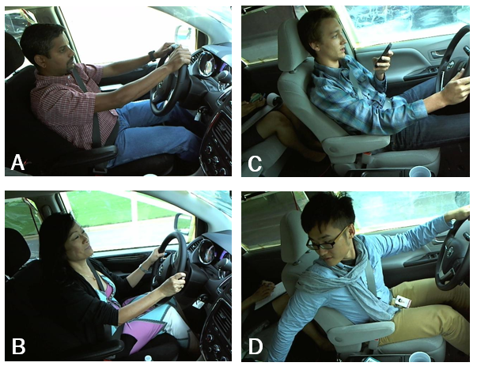

<!-- PROJECT LOGO -->
<br />
<p align="center">
  <a href="https://github.com/catiaspsilva/README-template">
    
  </a>

  <h3 align="center">README Template</h3>

  <p align="center">

  </p>
</p>


<!-- TABLE OF CONTENTS -->
<details open="open">
  <summary>Table of Contents</summary>
  <ol>
    <li>
      <a href="#about-the-project">About The Project</a>
      <ul>
        <li><a href="#built-with">Built With</a></li>
      </ul>
    </li>
    <li>
      <a href="#getting-started">Getting Started</a>
      <ul>
        <li><a href="#dependencies">Dependencies</a></li>
        <li><a href="#installation">Installation</a></li>
      </ul>
    </li>
    <li><a href="#usage">Usage</a></li>
    <li><a href="#roadmap">Roadmap</a></li>
    <li><a href="#contributing">Contributing</a></li>
    <li><a href="#license">License</a></li>
    <li><a href="#authors">Authors</a></li>
    <li><a href="#acknowledgements">Acknowledgements</a></li>
  </ol>
</details>


<!-- ABOUT THE PROJECT -->
## About The Project

  The leading cause of fatal accidents in the U.S. is due to distracted driving. Although self-driving technologies are becoming commercially prevalent in the U.S., drivers are expected to be fully alert, prepared to take over at any moment. Many newer vehicles are equipped with driver alert systems, which monitor a driver’s behavior either through data collected from external sensors or through a camera system and warn or alert the driver when unsafe behavior is detected. This work will apply and compare various deep learning models to the publicly available State Farm Distracted Driver Detection dataset as well as estimate tighter risk bounds of false positives for distracted drivers than would generally be obtained through confidence intervals. Risk bound characterizations, like binomial proportion confidence intervals, will be determined.

[Read the full paper here](https://github.com/Andres-G-Gomez/distracted-drivers/blob/main/final_paper.pdf)

[View the PowerPoint](https://github.com/Andres-G-Gomez/distracted-drivers/blob/main/presentation.pdf)

<!-- GETTING STARTED -->
## Getting Started

### Dependencies

Here, list all libraries, packages and other dependencies that need to be installed to run your project. Include library versions and how they should be installed if a special requirement is needed.

For example, this is how you would list them:
* Numpy 1.23.0
  ```sh
  pip install numpy 1.23.0
  ```
* Tensorflow 2.9.1
  ```sh
  pip install tensorflow 2.9.1
  ```
* Pandas 1.1.3
  ```sh
  pip install pandas 1.1.3
  ```
* Sklearn 0.23.2
  ```sh
  pip install scikit-learn 0.23.2
  ```
* Skimage 0.17.2
  ```sh
  pip install scikit-image 0.17.2
  ```
* Statsmodels 0.12.0
  ```sh
  pip install statsmodels 0.12.0
  ```
 
### Installation

1. Clone the repo
   ```sh
   git clone https://github.com/Andres-G-Gomez/distracted-drivers
   ```
2. Setup (and activate) your environment
  ```sh
  conda env create -f requirements.yml
  ```

<!-- USAGE EXAMPLES -->
## Usage

Roughly 2500 images were sampled from the [State Farm Distracted Dataset](https://www.kaggle.com/competitions/state-farm-distracted-driver-detection/data). The images were then reshaped to 300x300, flattened, and saved to an array named "data_small.npy." The respective labels, distracted or alert, were also saved in a datafile named "labels_small.npy." The script used to train the CNN calls on these datafiles. The Jupyter notebook can be found [here](https://github.com/Andres-G-Gomez/distracted-drivers/blob/main/final_CNN_etc.ipynb).

<!-- ROADMAP -->
## Roadmap

See the [open issues](https://github.com/Andres-G-Gomez/distracted-drivers/issues) for a list of proposed features (and known issues).

<!-- CONTRIBUTING -->
## Contributing

Contributions are what make the open source community such an amazing place to be learn, inspire, and create. Any contributions you make are **greatly appreciated**.

1. Fork the Project
2. Create your Feature Branch (`git checkout -b feature/AmazingFeature`)
3. Commit your Changes (`git commit -m 'Add some AmazingFeature'`)
4. Push to the Branch (`git push origin feature/AmazingFeature`)
5. Open a Pull Request


<!-- LICENSE -->
## License

Distributed under the MIT License. See `LICENSE` for more information.


<!-- Authors -->
## Authors

Andres Gomez - [@AndresG0508](https://twitter.com/AndresG0508) - Andresggomez@ufl.edu

Project Link: [https://github.com/Andres-G-Gomez/distracted-drivers](https://github.com/Andres-G-Gomez/distracted-drivers)


<!-- ACKNOWLEDGEMENTS -->
## Acknowledgements

You can acknowledge any individual, group, institution or service.
* [Catia Silva](https://faculty.eng.ufl.edu/catia-silva/)
* [GitHub Emoji Cheat Sheet](https://www.webpagefx.com/tools/emoji-cheat-sheet)
* [Img Shields](https://shields.io)
* [Choose an Open Source License](https://choosealicense.com)
* [GitHub Pages](https://pages.github.com)
* [Animate.css](https://daneden.github.io/animate.css)
* [Loaders.css](https://connoratherton.com/loaders)
* [Slick Carousel](https://kenwheeler.github.io/slick)

## Thank you

<!-- If this is useful: [](https://www.buymeacoffee.com/andresgg) -->
